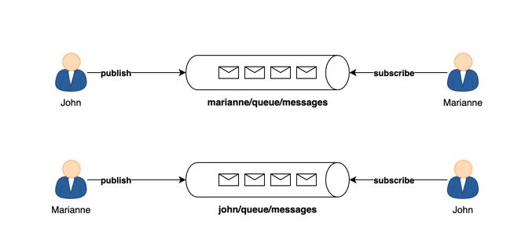

# Project Name

One On One Chat application | Spring boot & WebSocket |

## Overview

#### Here is a demo of the application


#### Full Tutorial link

[Watch the Tutorial](https://www.youtube.com/watch?v=7T-HnTE6v64&ab_channel=BoualiAli)


## Table of Contents

- [Features](#features)
- [Installation](#installation)
- [Technologies](#technologies)

## Features

- One to one chat application
- Secure communication
- Persistent chat



---


---

## Installation

Provide step-by-step instructions on how to install and set up your project locally.

```bash
# Clone the repository
git clone https://github.com/ali-bouali/one-to-one-chat-spring-boot-web-socket

# Change into the project directory
cd your-project

# Build the project
./mvnw clean install
```

---
## Technologies

This project is mainly implement using the following technologies

- Websocket
- Spring Boot 3.x.x
- MongoDB
- Javascript
- HTML
- CSS

---

